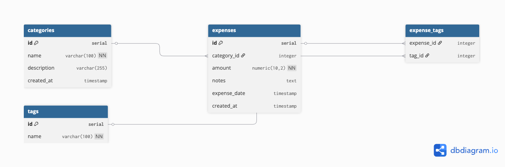

# 🐾 Pumba Tracker

A personal expense tracker built to manage the real cost of owning a French Bulldog named Pumba. French Bulldogs are expensive — Pumba eats fresh food due to allergies, requires frequent vet visits, and has pricey pet insurance. This app lets me log expenses as they happen, organize them by category, and tag them so I can always see exactly what Pumba costs me.

## Live App
[Click here to open Pumba Tracker](https://pumba-tracker-grbyf9dcus6gakxhg6wqev.streamlit.app/)

## ERD

## Table Descriptions

**categories** — Stores expense categories like Food, Vet, Insurance, Grooming, and Misc. Each category has a name and optional description.

**expenses** — The main table. Stores each expense with an amount, date, notes, and a reference to its category.

**tags** — Stores tags like Recurring, Emergency, One-time, and Insurance-covered that can be applied to expenses.

**expense_tags** — Junction table linking expenses to tags. One expense can have many tags and one tag can apply to many expenses (many-to-many relationship).

## How to Run Locally

1. Clone this repository
2. Install dependencies: `pip install -r requirements.txt`
3. Create a `.streamlit/secrets.toml` file with your database connection:
4. 4. Run the app: `streamlit run streamlit_app.py`

## Pages
- **Home** — Dashboard with spending metrics and recent expenses
- **Log Expense** — Form to log a new expense
- **Expense History** — Searchable, filterable list of all expenses with edit and delete
- **Manage Categories** — Add, edit, and delete expense categories
- **Manage Tags** — Add, edit, and delete tags
